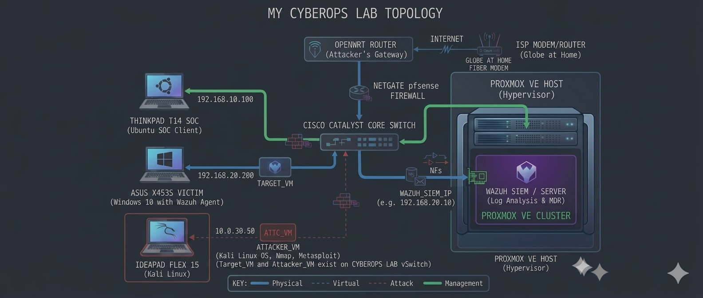

# 🛡️ CyberOps Home Lab



> **A personal cybersecurity laboratory for hands-on SOC operations, threat detection, incident response, penetration testing, vulnerability assessment, network security, and continuous security research. The CyberOps Home Lab is an ongoing project rather than a finished environment.

As I continue developing my cybersecurity skills, the lab will continue to evolve with new infrastructure, technologies, detection techniques, attack simulations, and defensive capabilities.**

---

## 📑 Table of Contents

* [Overview](#-overview)
* [Lab Objectives](#-lab-objectives)
* [Lab Architecture](#-lab-architecture)
* [Lab Roles](#-lab-roles)
* [Infrastructure](#-infrastructure)
* [Operating Systems](#-operating-systems)
* [Security Stack](#-security-stack)
* [SOC & Blue Team Operations](#-soc--blue-team-operations)
* [Offensive Security & Adversary Simulation](#-offensive-security--adversary-simulation)
* [Network Security](#-network-security)
* [Threat Detection & Monitoring](#-threat-detection--monitoring)
* [Incident Response](#-incident-response)
* [Cybersecurity Training](#-cybersecurity-training)
* [Hands-On Labs](#-hands-on-labs)
* [Skills Developed](#-skills-developed)
* [Lab Methodology](#-lab-methodology)
* [Example Scenarios](#-example-scenarios)
* [Security & Isolation](#-security--isolation)
* [Continuous Improvement](#-continuous-improvement)
* [Future Enhancements](#-future-enhancements)
* [Disclaimer](#-disclaimer)

---

# 🔎 Overview

The **CyberOps Home Lab** is my personal, isolated cybersecurity environment designed to provide practical experience across both **offensive and defensive security operations**.

Rather than relying exclusively on theoretical learning, I use the lab to recreate realistic security scenarios involving an **attacker**, **victim endpoint**, and **SOC/defender environment**.

The environment allows me to generate controlled security events, collect telemetry, investigate activity, identify indicators of compromise, develop detection logic, perform incident analysis, and practice appropriate defensive responses.

The lab is continuously evolving as I learn new technologies, complete security training, and experiment with different attack and defense techniques.

### Core focus areas

```text
┌─────────────────────────────────────────────────┐
│                  CYBEROPS LAB                   │
├─────────────────────────────────────────────────┤
│                                                 │
│  🔵 SOC / Blue Team                             │
│  🟣 Threat Detection                            │
│  🟢 Incident Response                           │
│  🟡 Network Security                            │
│  🟠 Threat Intelligence                         │
│  ⚪ Security Research                           │
│  🔴 Offensive Security                          │
└─────────────────────────────────────────────────┘
```

---

# 🎯 Lab Objectives

The primary objective of this laboratory is to develop **practical, repeatable cybersecurity skills** through controlled experimentation.

### Key objectives

* Build and maintain an isolated cybersecurity environment.
* Simulate realistic attack and defense scenarios.
* Practice SOC analyst workflows.
* Generate and investigate security telemetry.
* Develop detection and monitoring capabilities.
* Perform vulnerability assessment and penetration testing.
* Analyze network traffic and endpoint activity.
* Practice incident detection, triage, investigation, and response.
* Develop familiarity with SIEM, EDR/HIDS, network-security, and forensic tooling.
* Improve Linux and Windows security administration skills.
* Understand attacker behavior from a defender's perspective.
* Document findings and lessons learned.
* Continuously expand the lab as new technologies and techniques are studied.

---

# 🏗️ Lab Architecture

The laboratory uses a combination of **physical systems, virtualization, networking equipment, and security platforms**.

A simplified representation of the environment is:

```text
                         INTERNET
                            │
                            ▼
                     ┌─────────────┐
                     │   ROUTER    │
                     └──────┬──────┘
                            │
                    ┌───────▼────────┐
                    │  LAB NETWORK   │
                    │  / VLANs       │
                    └───────┬────────┘
                            │
             ┌──────────────┼──────────────┐
             │              │              │
             ▼              ▼              ▼
      🔴 ATTACKER      🔵 SOC / BLUE    🟢 VICTIM
         SYSTEM            TEAM           SYSTEM
             │              │              │
             │              │              │
       Kali / Parrot    Wazuh / Elastic   Windows
             │          Kibana / SIEM       Linux
             │              │              │
             └──────────────┼──────────────┘
                            │
                            ▼
                      ┌───────────┐
                      │ PROXMOX   │
                      │ / VMs     │
                      └───────────┘
```

The actual architecture is continuously modified depending on the scenario being investigated.

---

# 🖥️ Lab Roles

One of the main characteristics of this laboratory is the separation of systems into different operational roles.

## 🔴 Attacker Environment

Used to simulate adversary activity inside an authorized and isolated environment.

Examples include:

* Kali Linux
* Parrot Security OS
* Nmap
* Burp Suite
* Metasploit
* Wireshark
* Gobuster
* Nikto
* Netcat
* Enumeration tools
* Vulnerability assessment tools

The objective is not simply to run tools, but to understand the **attack lifecycle and the telemetry generated by each activity**.

---

## 🔵 SOC / Defender Environment

The defender environment is used to operate as a security analyst.

Activities include:

* Monitoring endpoints
* Investigating alerts
* Searching security events
* Correlating logs
* Analyzing suspicious activity
* Investigating indicators of compromise
* Performing alert triage
* Creating detection logic
* Documenting incidents
* Performing root-cause analysis

---

## 🟢 Victim Environment

The victim systems simulate endpoints that could exist within an organization.

Examples:

* Windows workstation
* Linux workstation/server
* Vulnerable test machines
* Intentionally misconfigured services
* Web applications
* Test accounts and services

These systems generate realistic endpoint and network telemetry for the defensive environment.

---

# 🖥️ Infrastructure

## Virtualization

I use virtualization to create isolated and repeatable security environments.

### Platforms

* **Proxmox VE**
* **VirtualBox**

Virtual machines allow me to deploy different operating systems and security tools without requiring a separate physical machine for every role.

Examples:

```text
Proxmox
│
├── SOC / SIEM Server
├── Wazuh Manager
├── Elastic Stack
├── Kibana
├── Linux Server
├── Windows Endpoint
├── Vulnerable VM
└── Security Testing VM
```

This also allows snapshots and isolated test environments to be created before conducting experiments.

---

# 💻 Operating Systems

The laboratory uses multiple operating systems to simulate heterogeneous environments.

### Linux

* Kali Linux
* Parrot Security OS
* Ubuntu
* Other Linux distributions depending on the scenario

### Windows

* Windows workstation environments
* Windows Server environments where required

Using multiple operating systems allows me to study differences in:

* Authentication
* Logging
* Processes
* Services
* Network behavior
* File systems
* Security controls
* Endpoint telemetry

---

# 🛡️ Security Stack

The lab incorporates multiple security platforms and tools.

## SIEM / Security Monitoring

### Elastic Stack

* Elasticsearch
* Kibana
* Beats / Elastic Agents where applicable

Used for:

* Centralized log collection
* Event search
* Visualization
* Dashboard creation
* Log correlation
* Security investigation

### Wazuh

Used for:

* Host-based monitoring
* File Integrity Monitoring
* Security event collection
* Vulnerability detection
* Endpoint monitoring
* Configuration assessment
* Threat detection
* Security alerting

Wazuh provides endpoint telemetry that can then be investigated as part of the SOC workflow.

---

# 🔵 SOC & Blue Team Operations

A major component of the laboratory is practicing the workflow of a SOC analyst.

The general workflow is:

```text
                SECURITY EVENT
                      │
                      ▼
                Alert / Signal
                      │
                      ▼
                    Triage
                      │
             ┌────────┴────────┐
             │                 │
          Benign            Suspicious
             │                 │
             ▼                 ▼
          Close            Investigate
                               │
                               ▼
                         Collect Evidence
                               │
                               ▼
                         Correlate Events
                               │
                               ▼
                       Determine Severity
                               │
                               ▼
                         Containment
                               │
                               ▼
                          Remediation
                               │
                               ▼
                       Lessons Learned
```

### SOC activities

* Alert triage
* Log analysis
* Event correlation
* Endpoint investigation
* Network investigation
* IOC analysis
* Suspicious process investigation
* Authentication-event analysis
* Malware-related investigation
* Phishing analysis
* Incident documentation
* Detection improvement

---

# 🔍 Threat Detection & Monitoring

The laboratory is used to understand how attacks appear from the defender's perspective.

Examples of telemetry investigated include:

* Failed login attempts
* Successful authentication
* Privilege changes
* Suspicious processes
* Network connections
* File modifications
* Persistence mechanisms
* Command execution
* PowerShell activity
* System configuration changes
* Web requests
* DNS activity
* Port scanning
* Malware indicators
* Suspicious IP addresses
* Hashes and other indicators

The goal is to understand the relationship between:

```text
ATTACK
  ↓
SYSTEM ACTIVITY
  ↓
LOG / TELEMETRY
  ↓
DETECTION
  ↓
ALERT
  ↓
INVESTIGATION
```

---

# 🔴 Offensive Security & Adversary Simulation

The offensive side of the lab is used to understand common attack techniques and how those techniques can be detected.

Activities include:

* Network reconnaissance
* Port scanning
* Service enumeration
* Web application testing
* Vulnerability assessment
* Authentication testing
* Exploitation in intentionally vulnerable environments
* Privilege escalation practice
* Post-exploitation analysis
* Network traffic analysis
* Web security testing

Tools include:

* Nmap
* Burp Suite
* Metasploit
* Wireshark
* Gobuster
* Nikto
* Netcat
* Linux security utilities
* Other tools depending on the scenario

The offensive environment is used strictly against systems that I own or have explicit authorization to test.

---

# 🌐 Network Security

Networking is an important component of the lab because many security events are only meaningful when endpoint and network telemetry are analyzed together.

Areas practiced include:

* TCP/IP
* DNS
* HTTP/HTTPS
* SSH
* Network segmentation
* VLAN concepts
* Firewall rules
* Routing
* Port scanning
* Packet analysis
* Traffic monitoring
* Network troubleshooting
* Secure remote access

### Network analysis

Wireshark is used to inspect network traffic and understand:

* Source/destination relationships
* Protocol behavior
* TCP connections
* DNS requests
* HTTP traffic
* Suspicious communication patterns
* Scanning behavior

---

# 🚨 Incident Response

The lab is also used to practice the lifecycle of a security incident.

### Example workflow

**1. Detection**

A suspicious event generates an alert.

**2. Triage**

Determine whether the alert represents:

* False positive
* Benign activity
* Suspicious activity
* Confirmed incident

**3. Investigation**

Analyze:

* User
* Host
* IP address
* Process
* File
* Timestamp
* Network connection
* Related events

**4. Containment**

Simulate appropriate defensive actions such as isolating the affected endpoint or blocking malicious communication.

**5. Eradication**

Identify and remove the underlying cause in the controlled environment.

**6. Recovery**

Restore the system to a known-good state.

**7. Lessons Learned**

Document:

* What happened
* How it happened
* What was detected
* What was missed
* How detection could be improved

---

# 🧪 Example Scenarios

The lab can be used to reproduce controlled scenarios such as:

### Network Reconnaissance

```text
Attacker
   │
   │ Port Scan
   ▼
Victim
   │
   ▼
Network Telemetry
   │
   ▼
SOC
   │
   ▼
Investigate Scanner
```

### Brute-Force Simulation

```text
Attacker
   │
   │ Authentication Attempts
   ▼
Victim
   │
   ▼
Authentication Logs
   │
   ▼
Wazuh / Elastic
   │
   ▼
SOC Investigation
```

### Suspicious Process Execution

```text
User / Attacker
       │
       ▼
Command Execution
       │
       ▼
Windows / Linux Endpoint
       │
       ▼
Endpoint Telemetry
       │
       ▼
Wazuh
       │
       ▼
SOC Analyst
```

### Web Application Investigation

```text
Attacker
   │
   ▼
Web Application
   │
   ├── Access Logs
   ├── HTTP Requests
   └── Application Events
            │
            ▼
        Elasticsearch
            │
            ▼
          Kibana
            │
            ▼
       Investigation
```

---

# 📚 Cybersecurity Training

The home lab is complemented by hands-on cybersecurity training platforms.

## TryHackMe

I use **TryHackMe** to practice structured cybersecurity exercises covering areas such as:

* Networking
* Linux
* Windows
* Web security
* Enumeration
* Privilege escalation
* Security fundamentals
* SOC concepts
* Defensive security
* Incident response

## LetsDefend

I also use **LetsDefend** to practice SOC analyst workflows through simulated security operations.

Areas include:

* Alert investigation
* SIEM analysis
* Phishing investigation
* Malware analysis
* Network investigation
* Endpoint investigation
* IOC analysis
* Incident response
* SOC procedures

These platforms complement the home lab by providing scenarios that can then be reproduced or extended within my own environment where appropriate.

---

# 🧰 Security Tools & Technologies

The laboratory is continuously evolving, but commonly used technologies include:

### SIEM / Monitoring

* Wazuh
* Elasticsearch
* Kibana
* Elastic Agent / Beats

### Network Analysis

* Wireshark
* Nmap
* Netcat

### Web Security

* Burp Suite
* Gobuster
* Nikto

### Offensive Security

* Metasploit
* Kali Linux
* Parrot Security OS

### Infrastructure

* Proxmox VE
* VirtualBox
* Linux
* Windows
* Docker

### Investigation

* Linux command-line utilities
* Windows Event Logs
* Endpoint telemetry
* Hash analysis
* IP/domain investigation
* IOC enrichment

The exact tooling changes as the lab evolves and as new technologies are evaluated.

---

# 🧠 Skills Developed

This laboratory provides practical experience across several cybersecurity domains.

### Security Operations

* SOC monitoring
* Alert triage
* Log analysis
* Incident investigation
* IOC analysis
* Security event correlation

### Defensive Security

* Endpoint monitoring
* SIEM configuration
* Detection engineering
* Security monitoring
* Incident response
* Threat hunting

### Offensive Security

* Reconnaissance
* Enumeration
* Vulnerability assessment
* Web security testing
* Exploitation in controlled environments
* Privilege escalation

### Networking

* TCP/IP
* DNS
* HTTP/HTTPS
* Routing
* VLAN concepts
* Network segmentation
* Packet analysis
* Network troubleshooting

### Systems

* Linux administration
* Windows administration
* Virtualization
* Docker
* Infrastructure deployment

### Analytical Skills

* Investigating security alerts
* Identifying patterns
* Correlating multiple data sources
* Developing hypotheses
* Root-cause analysis
* Documenting technical findings

---

# 🧭 Lab Methodology

My approach is based around learning the relationship between **attack activity and defensive visibility**.

Instead of only asking:

> "Can I perform the attack?"

I also ask:

> "What would the defender see?"

> "Which logs were generated?"

> "Can the activity be detected?"

> "What indicators can be extracted?"

> "How could the detection be improved?"

This creates a continuous loop:

```text
Learn
  ↓
Simulate
  ↓
Generate Telemetry
  ↓
Detect
  ↓
Investigate
  ↓
Respond
  ↓
Document
  ↓
Improve Detection
  ↓
Repeat
```

---

# 📊 Documentation & Evidence

I document selected exercises and investigations to track progress and build a technical knowledge base.

Documentation may include:

* Lab architecture
* Investigation notes
* Screenshots
* Kibana dashboards
* Wazuh alerts
* Detection queries
* IOC information
* Attack timelines
* Incident summaries
* Lessons learned
* Configuration notes
* Troubleshooting procedures

Sensitive information, credentials, private network details, and potentially harmful operational information are intentionally excluded from public documentation.

---

# 🔐 Security & Isolation

All offensive testing performed within this laboratory is conducted against:

* Systems I own
* Intentionally vulnerable machines
* Isolated virtual machines
* Authorized training environments
* Platforms that explicitly permit security testing

The laboratory is designed to keep experimental activity separated from production systems.

Snapshots and isolated virtual environments are used whenever possible to allow systems to be safely restored after testing.

---

# 🚀 Continuous Improvement

This laboratory is not a static project.

I continuously experiment with:

* New SIEM technologies
* Detection rules
* Security monitoring tools
* Endpoint telemetry
* Network monitoring
* Threat intelligence
* Incident-response techniques
* Vulnerability assessment tools
* Automation
* Containerized security infrastructure
* Security-focused Linux environments

When a new technology is introduced, I evaluate how it can improve visibility, detection, investigation, or response.

---

# 🔮 Future Enhancements

Planned or potential improvements include:

* [ ] Expand the Proxmox virtualization environment
* [ ] Add additional Windows endpoints
* [ ] Add additional Linux servers
* [ ] Improve network segmentation
* [ ] Deploy additional VLANs
* [ ] Expand Wazuh monitoring
* [ ] Expand Elastic/Kibana dashboards
* [ ] Create custom detection rules
* [ ] Build additional SOC investigation playbooks
* [ ] Integrate additional threat-intelligence sources
* [ ] Experiment with EDR technologies
* [ ] Implement centralized authentication logging
* [ ] Add honeypot systems
* [ ] Build automated security-response workflows
* [ ] Develop additional attack/defense scenarios
* [ ] Improve incident documentation
* [ ] Automate repetitive lab deployment tasks

---

# 📈 What This Lab Represents

This project represents my transition from learning cybersecurity concepts theoretically to **building, operating, breaking, monitoring, and defending systems in a controlled environment**.

The laboratory gives me a place to continuously practice the complete security lifecycle:

```text
           OFFENSE
              │
              ▼
       Generate Activity
              │
              ▼
        Collect Evidence
              │
              ▼
          DETECTION
              │
              ▼
         INVESTIGATION
              │
              ▼
          RESPONSE
              │
              ▼
         IMPROVEMENT
              │
              └──────────────┐
                             │
                             ▼
                         OFFENSE
```

The objective is not simply to collect security tools, but to understand **how those tools work together as part of an operational security environment**.

---

# 🎓 Learning Philosophy

I use this lab as a continuous learning environment.

My learning process combines:

* Personal experimentation
* Home-lab projects
* SOC simulations
* TryHackMe labs
* LetsDefend investigations
* Capture-the-Flag exercises
* Security research
* Documentation
* Troubleshooting
* Real-world security concepts

The combination of offensive and defensive exercises helps me develop a more complete understanding of cybersecurity operations.

---

# 📌 Disclaimer

This laboratory is intended strictly for **education, authorized security testing, defensive research, and controlled experimentation**.

All attack simulations are performed against systems and environments that I own, have permission to test, or are intentionally provided for cybersecurity training.

No unauthorized systems, networks, or services are targeted.

---

# 🛡️ Final Note

The **CyberOps Home Lab** is an ongoing project rather than a finished environment.

As I continue developing my cybersecurity skills, the lab will continue to evolve with new infrastructure, technologies, detection techniques, attack simulations, and defensive capabilities.

> **Build it. Break it. Monitor it. Investigate it. Defend it. Learn from it.**

**Cybersecurity is learned by doing.**
